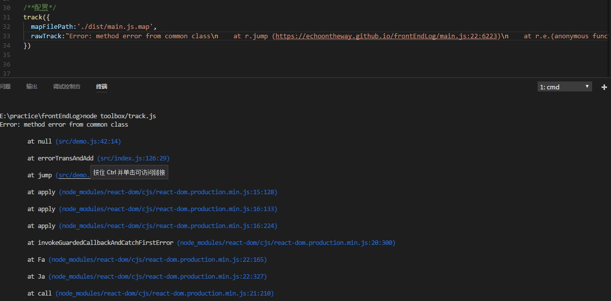

# frontEndLog [](https://travis-ci.org/echoontheway/frontEndLog)

## 前端埋点的目的 
  - 用户行为分析，改善用户体验  
  - 辅助生产问题追踪  
  - 监控代码错误量    

## 前端埋点的现有解决方案
 - 代码埋点，即在需要埋点的节点调用接口直接上传埋点数据，友盟、百度统计等第三方数据统计服务商大都采用这种方案    
 - 可视化埋点，即通过可视化工具配置采集节点，在前端自动解析配置并上报埋点数据，从而实现所谓的“无痕埋点”， 代表方案是已经开源的[Mixpanel](https://github.com/mixpanel)  
 - “无埋点”，它并不是真正的不需要埋点，而是前端自动采集全部事件并上报埋点数据，在后端数据计算时过滤出有用数据，代表方案是国内的GrowingIO    
**可视化埋点开发成本较高，‘无埋点’将带来较高流量消耗和数据计算成本，本模块提供了一个轻量的、非入侵式的前端埋点方案，并给出了一个小工具（track.js）作错误栈的源码映射**

## 代码实现
### mode
 - dev:log&&print,开发模式或者querystring上含有log  
 - prod:log  
 - close(default):no log&&no print  
### PV collect
- 目标：访问统计  
- 实现：`logVisit` via cookie
### user action collect
 - 目标：收集用户的点击、hover行为
 - 实现： `@trackActon(message)` 收集调用的类的方法名、参数、调用的时间，采用修改器实现非入侵式地收集
### script error catch
 - 目标：捕获代码运行时的抛错（message, stack,file, line, col）
 - 实现：
   * 一、对于react的组件类（extends React.Component）  
        1.`<errorBoundary></errorBoundary>` 捕获组件constructor、render、生命周期方法中的错误(其中的异步回调的抛错无法捕获)  
        2.`@catchMethod`捕获单个方法的抛错，适用于event handler，采用修改器实现非入侵式地收集
   * 二、对于普通类  
        1.`@catchClass`捕获类自身所有方法的抛错（不含constructor,不含继承的方法）,采用修改器实现非入侵式地收集  
        2.`@catchMethod`捕获单个方法的抛错（不含constructor），采用修改器实现非入侵式地收集
   * 三、对于异步回调  
        1.手动catch后调用`errorTransAndAdd`进行收集  
        （1）promise   
        （2）async函数   
        2.`window.onerror`进行收集     
        （1）setTimeout   
   * 四、其它所有未捕获的抛错  
        1.`window.onerror`收集    
         非同源的script文件需要配置：  
        （1）<script>标签内增加**crossorigin**属性   
        （2）支持cors的response头**Access-Control-Allow-Origin**  
### start locally
```
npm start
```
## track.js
- 目标：线上引用的js文件为压缩混淆后的生产版本，当发生js error时，上报的错误栈为生产版本的行列及文件名，不利于线上jserror定位。将sourcemap发布到生产，一则会导到源码暴露，二则sourcemap文件较大，很耗费带宽。考虑采用hiddensourcemap的方式，仅生成sourcemap并托管到代码库。在日常监控或生产问题追踪时，若需要分析jserror stack,可在线下，将生产日志记录的jserror stack复制到本模块,本模块利用sourcemap进行方法名、行、列、源文件名的映射
- 本地启动：`node toolbox/track.js`


## live demo
https://echoontheway.github.io/frontEndLog/

## license
MIT
